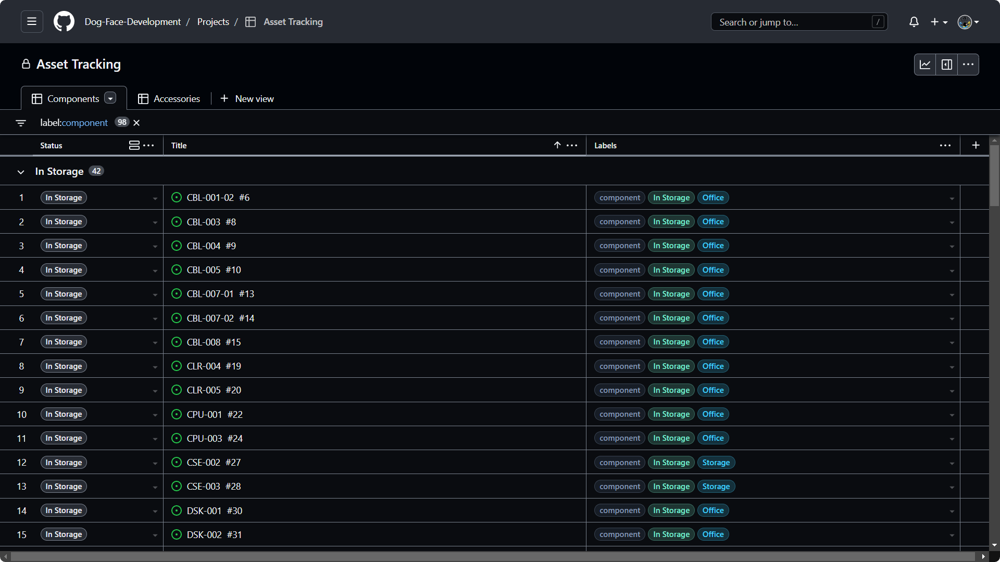

<!-- Logo -->
<h1 align="center">
  Inventory Tracking
   
</h1>

<!-- Copy -->
<h4 align="center">Easy to set up inventory and asset tracking through GitHub Issues and Projects.</h4>

<!-- Badges -->

  <!-- Issues -->
  
  <!-- Pull Requests -->
  
  <!-- Forks -->
  

<!-- Navigation -->

  <a href="#key-features">Key Features</a> •
  <a href="#how-to-use">How To Use</a> •
  <a href="#support">Support</a> •
  <a href="#contributors">Contributors</a>

<!-- Screenshot(s) -->

## Key Features

* Tracks inventory and assets.
* Built in Issue Templates.
* Issue labels for availability and location.
* Project boards.
* All data is backed up to the cloud.
* Built on GitHub's popular platform.
* Cross platform.

## How To Use

To create your own inventory or asset tracker based off this template, either [fork](https://github.com/Dog-Face-Development/inventory-tracking/fork) this repository or [generate a new repository](https://github.com/Dog-Face-Development/inventory-tracking/generate). Then, follow these steps to make the tracker your own:

1. Navigate to the `.github/ISSUE_TEMPLATE/` folder and edit the issue template names to the different types of items you would like to track. If necessary, create more issue templates for each category of item.
2. Edit the issue template headers with the respective **issue names**, **descriptions**, **titles**, and **automatically added labels** for each category.
3. Edit the issue template table with what kind of data should be stored for each item. In this template, this data is stored in a key-value pair, with the value placed between [backticks](https://en.wikipedia.org/wiki/Backtick).
4. Repeat the above steps for how ever many categories are needed to be tracked.
5. Navigate to the Issues page, and click on the **Labels** button. Add new labels for the **availability levels** and **locations** that should be tracked. It is recommended to add either "availability" or "location" in the description box to reduce confusion.
6. Create a new Issue for each inventory item or asset, using the specific category template.
7. Create a Project in **Table** view, and sort the items by their location and availability labels, much like a spreadsheet.
8. Finally, edit this `README` and the `CONTRIBUTING` document to help your team add items to the tracker.

## Support

If support is required, please open a **[GitHub Discussion](https://github.com/Dog-Face-Development/Periodic-Table-Info/discussions)**.

## Contributors

* [@willtheorangeguy](https://github.com/willtheorangeguy) - Sponsor on [PayPal](https://paypal.me/wvdg44?country.x=CA&locale.x=en_US)

## License

This project is licensed under the [Creative Commons Attribution 4.0 International Public License](https://creativecommons.org/licenses/by/4.0/) - see the [`LICENSE`](LICENSE.md) file for details.
